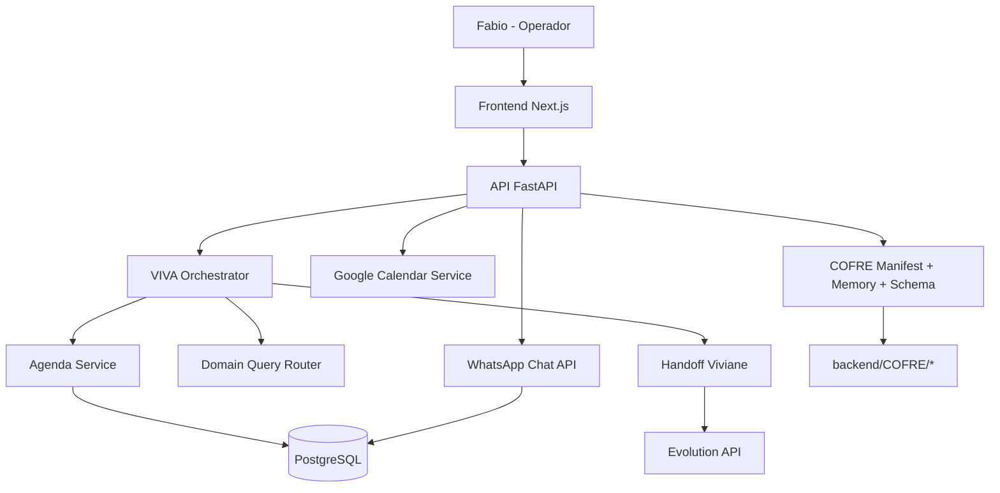

# TDD - CRM WhatsApp Institucional + Orquestração Fabio > VIVA > Viviane

| Campo | Valor |
| --- | --- |
| Tech Lead | Lucas Lebre |
| Product Owner | Fabio |
| Time | Backend, Frontend, Operações |
| Projeto | `fabio2` |
| Status | Draft para homologação final |
| Criado em | 2026-02-19 |
| Última atualização | 2026-02-19 |

## Contexto

O SaaS `fabio2` já opera contratos, clientes, agenda, campanhas e WhatsApp com backend FastAPI e frontend Next.js. A VIVA está integrada ao chat interno e possui COFRE como fonte canônica de persona/skills/memória.

A etapa atual exige fechar o módulo WhatsApp em nível institucional: transformar o menu em CRM operacional com métricas de funil, garantir handoff da persona Viviane, manter separação de papéis entre Fabio (decisor), VIVA (assistente interna) e Viviane (atendimento externo), e preparar a base para deploy Ubuntu na AWS.

## Definição do Problema e Motivação

### Problemas que estamos resolvendo

- O menu `/whatsapp` não refletia um CRM completo (funil e visão gerencial insuficientes).
  - Impacto: baixa governança operacional e pouca visibilidade de status de atendimento.
- A conversa VIVA tinha riscos de desvio de intenção (responder agenda/campanha fora do contexto).
  - Impacto: perda de confiança e atrito operacional.
- Integração de personas (Fabio > VIVA > Viviane) não estava explicitada como fluxo institucional único.
  - Impacto: risco de mistura de responsabilidades e mensagens inconsistentes.

### Por que agora

- A homologação do SaaS depende de estabilidade comportamental da VIVA e operação WhatsApp com rastreabilidade.
- Próxima etapa é deploy AWS Ubuntu; falhas de contrato funcional precisam ser encerradas antes da produção.

### Impacto de não resolver

- Homologação bloqueada.
- Operação WhatsApp sem funil gerencial e menor capacidade de acompanhamento.
- Risco de regressões de persona em produção.

## Escopo

### Em escopo (V1)

- Consolidar `/whatsapp` como CRM operacional institucional.
- Exibir métricas de funil (ativas, aguardando, arquivadas, total, mensagens do dia, taxa de fechamento).
- Exibir métricas de handoff Viviane (`pending`, `sent`, `failed`, total).
- Manter central de conversas separada em `/whatsapp/conversas`.
- Corrigir desvios de intenção VIVA detectados na auditoria recente.
- Consolidar COFRE sem artefatos runtime versionados.

### Fora de escopo (V1)

- Novo pipeline Gmail completo com UX dedicado (há API/status no backend, sem menu final nesta etapa).
- Motor de automação comercial avançado (SLA, prioridades, distribuição multi-atendente).
- Reengenharia total de schema WhatsApp (status de lead além de `ativa/aguardando/arquivada`).

### Considerações futuras (V2+)

- Menu institucional de Gmail e caixa unificada.
- Painel de pipeline comercial com estágios de oportunidade e conversão por origem.
- SLA de resposta, score de lead e automações por campanha.

## Solução Técnica

### Visão de arquitetura

### Componentes principais

- Frontend
  - `/(dashboard)/whatsapp/page.tsx`: CRM institucional com métricas + status integração.
  - `/whatsapp/conversas`: central operacional de conversa/mensagens.
- Backend
  - `viva_chat_orchestrator_service`: roteamento de chat e guard-rails de intenção.
  - `viva_agenda_nlu_service`: NLU de agenda com timezone consistente.
  - `viva_domain_query_router_service`: consultas de domínio (clientes/contratos/campanhas).
  - `whatsapp-chat` routes: fonte de dados de funil conversacional.
  - `viva/handoff` routes: estado operacional da Viviane.
- COFRE
  - Persona/skills em `backend/COFRE/persona-skills/`.
  - Memórias runtime apenas em disco local, não versionadas.

### Contratos de API usados no CRM WhatsApp

- `GET /api/v1/whatsapp/status`
- `POST /api/v1/whatsapp/conectar`
- `POST /api/v1/whatsapp/desconectar`
- `GET /api/v1/whatsapp-chat/status`
- `GET /api/v1/whatsapp-chat/conversas?status=ativa|aguardando|arquivada`
- `GET /api/v1/viva/handoff`

### Dados e persistência

- Conversas: `whatsapp_conversas`
- Mensagens: `whatsapp_mensagens`
- Handoff: `viva_handoff_tasks`
- Agenda: `agenda`
- COFRE runtime: espelho em `backend/COFRE/memories/<tabela>/` (somente runtime local)

## Riscos

| Risco | Probabilidade | Impacto | Mitigação |
| --- | --- | --- | --- |
| Regressão de intenção VIVA (desvio de domínio) | Média | Alto | Guard-rails de intenção + testes de prompts críticos |
| Divergência de horário agenda x Google | Média | Alto | Normalização timezone BRT + validação em API e UI |
| Métricas de funil inconsistentes por dados legados | Média | Médio | Definir regras explícitas de contagem e status operacional |
| Dependência de Evolution API | Média | Médio | Tratamento de erro claro + status de conexão no painel |
| Drift documental/API | Média | Médio | Atualização contínua de `docs/API.md` e validação de rotas runtime |

## Considerações de Segurança

- Autorização via Bearer JWT em rotas operacionais.
- Limitação de escopo por usuário (`require_operador`) nas consultas de agenda, handoff e conversas.
- Não expor segredos de provedores (Google/Evolution/OpenAI) no frontend.
- COFRE com governança: persona única, skills canônicas e memória auditável.
- Evitar respostas da VIVA afirmando execução sem prova de operação concluída.

## Estratégia de Testes

### Backend

- Testes de intenção (prompt-driven) para casos críticos:
  - Consulta agenda.
  - Instrução longa de memória de campanha.
  - Consulta de contratos/clientes com confirmação curta.
- Smoke de endpoints:
  - `/viva/chat`, `/whatsapp-chat/*`, `/viva/handoff`, `/cofre/*`.

### Frontend

- `npm run type-check`
- `npm run build`
- Teste manual de fluxo:
  - `/whatsapp` (métricas + conexão + handoff)
  - `/whatsapp/conversas` (seleção, envio e atualização)

### Critérios mínimos

- Sem warning crítico em build (somente warnings conhecidos e rastreados).
- Respostas VIVA determinísticas nos prompts auditados.
- Funil WhatsApp coerente com dados da API.

## Monitoramento e Observabilidade

### Métricas principais

- `conversas_ativas`
- `mensagens_hoje`
- handoff `pending/sent/failed`
- taxa de fechamento (arquivadas / total)

### Sinais de alerta

- Aumento súbito de `failed` em handoff.
- Queda abrupta de mensagens/dia com conexão ativa.
- Resposta VIVA fora de domínio para prompts não relacionados à agenda.

### Operação

- Endpoint de status e validação periódica de integração.
- Auditoria de COFRE via `/api/v1/cofre/memories/status` e `/api/v1/cofre/system/schema-status`.

## Plano de Implementação

### Fase 1 - Estabilização VIVA (concluída)

- Corrigir NLU e guard-rails de agenda/campanha.
- Corrigir timezone de criação e visualização de agenda.

### Fase 2 - CRM WhatsApp institucional (concluída em código)

- Evoluir `/whatsapp` para visão de funil + handoff + status de conexão + acesso à central.
- Corrigir warning de hook no frontend.

### Fase 3 - Fechamento funcional (pendente curta)

- Rodada de validação guiada com prompts críticos.
- Revisão final de documentação operacional.

### Fase 4 - Deploy AWS Ubuntu (próxima etapa)

- Congelar release candidate.
- Executar checklist runbook de produção.
- Validar saúde pós-deploy.

## Plano de Rollback

### Gatilhos

- Erro funcional crítico em VIVA (respostas fora de domínio recorrentes).
- Quebra operacional no funil WhatsApp.
- Inconsistência de horário em agenda com impacto de operação.

### Procedimento

1. Reverter para patch anterior (`rollback_gate_layout_viva_20260219_135831.patch` ou commit anterior estável).
2. Revalidar endpoints críticos (`/viva/chat`, `/whatsapp-chat/status`, `/viva/handoff`, `/cofre/*`).
3. Reabrir rollout com correção incremental.

## Dependências

- Evolution API (WhatsApp)
- Google Calendar OAuth
- PostgreSQL
- COFRE runtime local (`backend/COFRE/*`)

## Questões em Aberto

- Definir menu institucional de Gmail (dados já existem no backend, UX ainda não fechada).
- Definir estágio comercial formal além de `ativa/aguardando/arquivada`.
- Definir SLO de resposta da Viviane por categoria de lead.

## Critérios de Aceite

- `/whatsapp` com visão CRM/funil funcional e dados reais.
- VIVA não desvia para agenda em prompts longos de memória de campanha.
- VIVA não gera imagem automaticamente quando instrução é para memorizar regra.
- COFRE sem dados runtime versionados no Git.
- Build e type-check do frontend aprovados.
